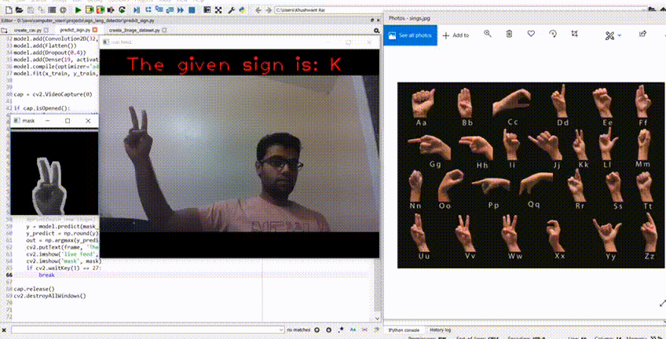

# Sign2Alphabet

**Version 1.0.0**

American sign alphabet detector using Deep Learning & Computer Vision

**Introduction**
The Sign2Alphabet project aims help people to learn sign language alphabets so that they can easily communicate with people who cannot speak or listen. Convolutional Neural Network(CNN) is used to train the data and Computer Vision is used to detect the American sign language symbol for various alphabets.

**Steps to detect a sign:**
>Creating Image Dataset:
* Image dataset can be created by running create_image_dataset.py file and a character viz 'a' should be entered to prepare image data folder for that character.
* As soon as 'd' is pressed on the keyboard, webcam will start clicking 786 images.
* Position or angles of sign can be changed for better training and results accuracy.

>Creating CSV file
* Next step is to create a csv file for detected image dataset containing different folders for different alphabets.
* Every image will be read by create_csv.py program and will be resized to 28x28 to save 784 corresponding pixels in a row of excell file.

>Training CNN model and Predicting Signs
* Then csv file is read and, CNN model is created and trained by predict_sign.py and the training process will take time.
* When the webcam will pop up on the screen, different sign can be shown to the camera and the result of prediction will be displayed on the live feed frame.

>Results
* CNN model achieved 98.78% accuracy and results clippings have been mentioned below.

---
## Contributors
- Khushwant Rai

---
## License & Copyright
© Khushwant Rai
